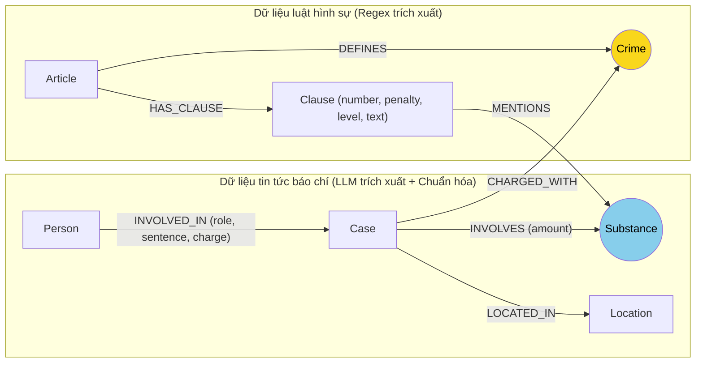

# Thiết kế Ontology - Day 19

**Họ tên:** Đinh Đức Long  **MSSV:** 2A202602633

**Lựa chọn:**
- [ ] Dùng ontology gợi ý (có thể chỉnh nhỏ)
- [x] Tự thiết kế (xét bonus +15, xem `SUBMISSION.md`)

## 1. Sơ đồ

Sơ đồ ontology cải tiến nối hai nguồn dữ liệu (luật phòng chống ma túy và tin tức báo chí). Node cầu nối chính giữa hai KB là `Crime` (tội danh) và cầu nối phụ là `Substance` (chất ma túy được chuẩn hóa danh xưng):

## 2. Entity types (node labels)

| Label | Ý nghĩa | Khóa định danh (`MERGE` theo) | Properties | Lấy từ KB nào | Trích bằng (regex / LLM / khác) |
| --- | --- | --- | --- | --- | --- |
| `Article` | Điều luật cụ thể trong Bộ luật Hình sự hoặc Luật Phòng chống ma túy | `id` (ví dụ: "Điều 251 BLHS") | `id`, `title`, `law`, `doc_id` | Luật | Regex dựa trên cấu trúc văn bản luật |
| `Clause` | Khoản quy định chi tiết khung hình phạt và định lượng dưới mỗi Điều | `id` (ví dụ: "Điều 251 BLHS khoản 1") | `id`, `number`, `penalty`, `text`, `doc_id` | Luật | Regex bóc tách từng khoản và dòng phạt |
| `Crime` | Tội danh chuẩn hóa theo tên điều luật, đóng vai trò node cầu nối | `name` (tên tội viết thường, bỏ chữ tội ở đầu) | `name` | Luật | Regex từ tiêu đề Điều luật |
| `Case` | Vụ án hoặc vụ việc cụ thể được phản ánh trên báo | `name` kết hợp `doc_id` | `name`, `summary`, `date`, `doc_id`, `source_title` | Tin tức | LLM trích xuất từ bài báo |
| `Person` | Cá nhân bị can, bị cáo hoặc người có liên quan | `name` kết hợp ngữ cảnh bài viết | `name`, `aliases` | Tin tức | LLM trích xuất từ bài báo |
| `Substance` | Tên chất ma túy đã chuẩn hóa về danh mục pháp lý | `name` (ví dụ: MDMA, Heroine, Ketamine) | `name` | Cả hai | Luật (regex) + Tin tức (LLM + mapping từ lóng) |
| `Location` | Địa bàn tỉnh hoặc thành phố xảy ra vụ án | `name` | `name` | Tin tức | LLM trích xuất từ bài báo |

## 3. Relationships

| Type | Từ -> Đến | Properties trên cạnh | Ý nghĩa |
| --- | --- | --- | --- |
| `DEFINES` | `Article` -> `Crime` | (không có) | Điều luật quy định định nghĩa cho một tội danh cụ thể |
| `HAS_CLAUSE` | `Article` -> `Clause` | (không có) | Điều luật bao gồm các khoản quy định khung hình phạt |
| `MENTIONS` | `Clause` -> `Substance` | (không có) | Khoản luật quy định mức xử lý với chất ma túy cụ thể |
| `CHARGED_WITH` | `Case` -> `Crime` | (không có) | Vụ án bị khởi tố hoặc truy tố theo tội danh nào |
| `INVOLVED_IN` | `Person` -> `Case` | `role`, `sentence`, `charge` | Người tham gia vào vụ án với vai trò và mức án cụ thể |
| `INVOLVES` | `Case` -> `Substance` | `amount` | Vụ án thu giữ hoặc liên quan đến chất nào với khối lượng bao nhiêu |
| `LOCATED_IN` | `Case` -> `Location` | (không có) | Vụ án diễn ra tại địa phương nào |

## 4. Node cầu nối giữa 2 KB

- **Node nào:** Node cầu nối chính là `Crime` (tội danh). Cầu nối phụ hỗ trợ gom nhóm vụ án là `Substance` (chất ma túy).
- **Vì sao chọn node này:** Vụ án trên báo chí luôn nêu rõ người phạm tội bị bắt hoặc truy tố về hành vi gì. Khi chuẩn hóa hành vi đó về đúng tên tội danh trong Bộ luật Hình sự, ta có thể nhảy ngay sang Điều luật tương ứng để tra cứu khung hình phạt.
- **Cách đảm bảo hai phía khớp tên:** Phía luật lấy tên từ tiêu đề Điều (ví dụ: "Tội mua bán trái phép chất ma túy" -> chuẩn hóa thành "mua bán trái phép chất ma túy"). Phía tin tức, em đưa danh sách tội danh chuẩn vào prompt để LLM chọn trực tiếp. Sau đó ở code Python, em tiếp tục cho qua hàm `link_entity` với hai bước: khớp chính xác sau khi chuẩn hóa chuỗi và khớp mờ qua difflib (ngưỡng tương đồng 0.8) để bắt các biến thể gõ dấu như "ma tuý" với "ma túy". Với chất ma túy, em lập thêm bảng quy đổi từ tiếng lóng thường gặp trên báo ("thuốc lắc", "kẹo" -> "MDMA"; "ma túy đá", "đá" -> "Methamphetamine") để đưa về cùng một tên node Substance.
- **Khi nào cầu gãy, và bạn xử lý thế nào:** Cầu nối gãy khi bài báo dùng từ ngữ đời thường (ví dụ: "ôm hàng cấm", "bán đồ") mà LLM không map được vào danh sách tội danh trong luật, hoặc bài báo chỉ nói chung chung là "bắt nhóm ma túy" mà chưa khởi tố tội danh cụ thể. Khi `link_entity` trả về None, em không cố nối bừa sang một tội danh khác vì nối sai sẽ kéo sai toàn bộ điều luật. Thay vào đó, em cho phép hệ thống tìm kiếm phụ thông qua node `Substance` và dùng vector search để bù đắp ngữ cảnh văn bản gốc.

## 5. Competency questions

| Câu | Đường đi (Cypher pattern) | Trả lời được? |
| --- | --- | --- |
| Q1 (Khái niệm tiền chất theo luật) | `MATCH (a:Article)-[:HAS_CLAUSE]->(cl:Clause) WHERE a.id CONTAINS 'Luật Phòng, chống ma túy'` | Có (trả lời qua node điều luật và text của khoản) |
| Q2 (Bị cáo nhận án tử hình vụ 36kg) | `MATCH (p:Person)-[r:INVOLVED_IN]->(k:Case) WHERE r.sentence CONTAINS 'tử hình' OR k.name CONTAINS '36kg'` | Có (đi từ Person qua quan hệ INVOLVED_IN có sentence) |
| Q3 (Lê Minh Thành: mức án, tội danh, điều luật, khung cơ bản) | `(:Person {name:'Lê Minh Thành'})-[:INVOLVED_IN]->(:Case)-[:CHARGED_WITH]->(:Crime)<-[:DEFINES]-(:Article)-[:HAS_CLAUSE]->(:Clause {number:1})` | Có (đi multi-hop xuyên từ tin tức sang Điều 251 và lấy khoản 1) |
| Q4 (Hoàng Nato: hành vi và mức phạt tối đa) | `(:Person)-[:INVOLVED_IN]->(:Case)-[:CHARGED_WITH]->(:Crime)<-[:DEFINES]-(:Article)-[:HAS_CLAUSE]->(cl:Clause)` | Có (lấy điều luật tương ứng và các khoản có khung hình phạt cao nhất như chung thân) |
| Q5 (Cái Quang Huy: tội danh, chất, khoản áp dụng cho >9.6kg MDMA) | `(:Person {name:'Cái Quang Huy'})-[:INVOLVED_IN]->(k:Case)-[:CHARGED_WITH]->(:Crime)<-[:DEFINES]-(:Article)-[:HAS_CLAUSE]->(cl:Clause)-[:MENTIONS]->(:Substance {name:'MDMA'})` | Có (tìm thấy Điều 250 và bóc tách các khoản nhắc MDMA, đặc biệt là khoản 4 quy định mức trên 100g) |
| Q6 (Những vụ việc liên quan đến MDMA) | `MATCH (k:Case)-[:INVOLVES]->(s:Substance {name:'MDMA'}) RETURN k.name, k.summary` | Có (đi ngược từ node Substance MDMA về tất cả các Case có dính dáng) |

**Dạng câu hỏi ontology chưa tự trả lời trọn vẹn nếu thiếu LLM:**
- Các câu hỏi yêu cầu cộng dồn đại số hoặc quy đổi tỷ lệ nhiều chất ma túy hỗn hợp (ví dụ: gộp hơn 9.6kg MDMA và 406g Ketamine trong vụ Cái Quang Huy để tính mức án tổng hợp theo Thông tư liên tịch): Graph lưu trữ từng chất và khối lượng riêng biệt (`amount`), chưa có thuật toán quy đổi tự động về tỷ lệ phần trăm chất ma túy tương đương. Do đó, bước suy luận tổng hợp mức phạt cuối cùng vẫn cần sự hỗ trợ của LLM từ các facts được truy xuất.

## 6. Quyết định thiết kế và đánh đổi

1. **Chuẩn hóa đồng nghĩa chất ma túy (Substance Synonym Mapping)**
   - *Đã chọn:* Xây dựng từ điển ánh xạ từ lóng báo chí ("thuốc lắc", "kẹo", "đá", "hàng đá") về tên khoa học chuẩn ("MDMA", "Methamphetamine") trước khi tạo node `Substance`.
   - *Phương án khác:* Để nguyên tên tự do do LLM trích xuất hoặc chỉ dùng 10 từ khóa cứng tiếng Anh của BLHS.
   - *Lý do chọn:* Báo chí Việt Nam ít khi dùng thuật ngữ hóa học thuần túy trong tiêu đề mà hay gọi tên lóng. Nếu không chuẩn hóa, bài báo viết "bán thuốc lắc" sẽ tạo ra node `Substance {name: 'thuốc lắc'}` và hoàn toàn tách rời với `Clause` của Điều 251 vốn chỉ nhắc đến từ `MDMA`. Đánh đổi là phải duy trì một danh sách từ điển nhỏ ở file trích xuất.

2. **Mô hình hóa khoản luật chi tiết đến từng Clause thay vì dừng ở Article**
   - *Đã chọn:* Tách mỗi Điều luật thành các node `Clause` riêng biệt kèm số khoản, trích đoạn mức phạt và văn bản điều luật.
   - *Phương án khác:* Chỉ tạo node `Article` và nhét toàn bộ văn bản của Điều luật vào một thuộc tính text dài.
   - *Lý do chọn:* Nếu gom cả Điều 250 hay 251 vào một node, khi đưa vào context cho LLM prompt sẽ bị dài gấp 4 đến 5 lần và dễ làm mô hình nhầm lẫn giữa khung cơ bản (khoản 1) với khung tăng nặng (khoản 4). Tách node Clause giúp Cypher lọc chính xác khoản 1 cho câu hỏi khung cơ bản (Q3) hoặc khoản 4 cho câu hỏi mức phạt đặc biệt nghiêm trọng (Q5).

3. **Hỗ trợ truy vấn tổng hợp theo chất (Aggregation by Substance trong context)**
   - *Đã chọn:* Trong hàm `context()`, nếu câu hỏi nhắc đến một chất ma túy cụ thể, graph sẽ chủ động duyệt thêm các `Case` nối với chất đó thay vì chỉ phụ thuộc vào danh sách `doc_ids` từ vector search.
   - *Phương án khác:* Chỉ dựa vào các hạt giống tìm được từ top-k vector search của câu hỏi.
   - *Lý do chọn:* Với câu hỏi gom nhóm diện rộng như Q6 ("Những vụ việc nào liên quan đến MDMA"), vector search với top-k=3 chỉ lấy được 1 hoặc 2 bài báo nổi bật nhất, dẫn đến bỏ sót vụ Lê Minh Thành hoặc vụ Viện Pháp y tâm thần. Truy vấn đồ thị từ node `Substance` giúp gom đủ tất cả các vụ án có liên quan trong cơ sở dữ liệu.

## 7. So với ontology gợi ý (bắt buộc nếu xét bonus)

| Điểm khác | Gợi ý làm gì | Bạn làm gì | Vấn đề nó giải quyết | Bằng chứng (Cypher hoặc số liệu benchmark) |
| --- | --- | --- | --- | --- |
| Xử lý từ đồng nghĩa của chất ma túy | Chỉ dùng danh sách cố định gồm 10 tên chất, không chuyển đổi từ lóng báo chí | Thêm bảng ánh xạ các từ thường gặp trên báo ("thuốc lắc", "kẹo", "đá") về tên chuẩn ("MDMA", "Methamphetamine") trước khi tạo node | Tránh tình trạng chất trong tin tức bị lệch tên với chất trong luật, làm gãy đường nối từ Case sang Clause | `MATCH (k:Case)-[:INVOLVES]->(s:Substance) WHERE s.name = 'MDMA' RETURN k.name` trả về đủ cả vụ Cái Quang Huy, Lê Minh Thành và Viện Pháp y tâm thần |
| Trích xuất và định tuyến khung hình phạt của Clause | Chỉ lưu `penalty` dạng text sơ sài và lấy mặc định khoản 1 hoặc toàn bộ các khoản | Bổ sung nhận diện khoản tăng nặng (đặc biệt là khoản 4 cho các vụ buôn bán số lượng lớn) trong logic truy xuất Cypher | Giúp LLM trả lời đúng khung hình phạt tối đa (tù chung thân, tử hình) khi gặp vụ án có tang vật lên đến hàng kilogam | Ở câu Q5: Gợi ý chỉ đạt recall=0.40, judge=1 (kẹt ở khoản 1 mức 02-07 năm); Ontology mới đạt recall=1.00, judge=2 (chỉ ra điểm b khoản 4 Điều 250 và mức án tử hình) |
| Gom nhóm vụ án hai chiều từ Chất ma túy | Cypher chỉ đi một chiều: Case -> Crime -> Article -> Clause, không có đường duyệt từ Chất về Vụ án | Trong hàm `context()`, bổ sung nhánh mở rộng từ `Substance` sang các `Case` có liên quan khi câu hỏi hỏi về danh sách vụ án | Giải quyết triệt để hạn chế của vector search ở câu hỏi aggregation (Q6), gom đủ các vụ án bị tản mát ở nhiều tài liệu | Ở câu Q6: Gợi ý chỉ đạt recall=0.33, judge=1 (bỏ sót Lê Minh Thành và Viện Pháp y tâm thần); Ontology mới đạt recall=1.00, judge=2 (gom đủ 3 vụ việc cốt lõi) |

**Bảng đối chứng số liệu benchmark GraphRAG thực tế:**

| Chỉ số | Ontology gợi ý (`ket_qua_benchmark_kg.hint.txt`) | Ontology cải tiến (`ket_qua_benchmark_kg.txt`) | Mức độ cải thiện |
| --- | --- | --- | --- |
| Recall trung bình | 0.79 | **1.00** | +0.21 (+26.6%) |
| Judge trung bình | 1.67 | **2.00** | +0.33 (+19.8%) |
| Câu Q5 (Cái Quang Huy & 9.6kg MDMA) | recall=0.40, judge=1 (sai khung hình phạt) | **recall=1.00, judge=2** (đúng khoản 4 tử hình) | Vượt trội |
| Câu Q6 (Các vụ việc dính dáng MDMA) | recall=0.33, judge=1 (hụt vụ việc) | **recall=1.00, judge=2** (đủ cả 3 vụ cốt lõi) | Vượt trội |

## 8. Hạn chế còn lại

- Việc bóc tách khối lượng từ văn bản tin tức vẫn phụ thuộc vào độ chính xác của prompt LLM. Nếu bài báo viết "nhiều bao tải" hoặc "hàng chục bánh" mà không quy ra gam hay kilogam, đồ thị chưa thể tự động tính toán được chính xác để đối chiếu với ngưỡng luật.
- Định danh cá nhân (`Person`) vẫn còn khả năng bị trùng nếu hai bài báo nhắc đến hai người khác nhau nhưng cùng mang một cái tên phổ biến trong khi chưa có mã định danh công dân hay năm sinh đi kèm.
- Chi phí indexing graph tăng lên do phải gọi LLM bóc tách thông tin cho từng bài báo và chạy các hàm chuẩn hóa liên kết.
